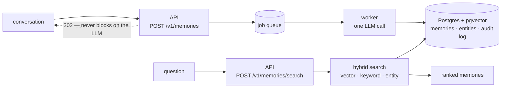

<p align="center">
  <picture>
    <source media="(prefers-color-scheme: dark)" srcset="assets/memora-mark-white.svg">
    
  </picture>
</p>

<h1 align="center">memora</h1>

<p align="center"><strong>Agent memory, built to be corrected.</strong></p>

<p align="center">
  <a href="https://github.com/why-shashank/memora/actions/workflows/ci.yml"></a>
  
  
  
  <a href="https://www.conventionalcommits.org"></a>
  <a href="LICENSE"></a>
</p>

<p align="center">
  <em>self-hosted &nbsp;·&nbsp; append-only &nbsp;·&nbsp; open source</em>
</p>

> [!WARNING]
> **Work in progress — not production-ready.** memora is incomplete and under active development. The write and read paths work, and every number below came out of the eval harness — but none of this has run outside my own machine. Expect rough edges, expect the API to change, and read the quickstart as *should work* rather than *known to work everywhere*. If something behaves differently from what's described here, that's a bug worth reporting rather than something you're doing wrong.

An agent that forgets is annoying. An agent that confidently remembers something *wrong* is worse, because it acts on it. memora is built around that second problem: every stored fact carries who produced it, how it got there, and an append-only trail of what happened to it.

Self-host first. One database, your own LLM key, no outbound connection you didn't ask for.

---

## What it does

You hand memora a conversation. It extracts the durable facts — not the whole transcript, not the help-article content — and stores each one typed, scoped, and attributed. Later you ask a question in plain language and get back the memories that matter, ranked.



**Writes are asynchronous.** The API returns a job id immediately and an extraction worker does the LLM call off the hot path, so the agent's turn is never waiting on a model.

**Reads are one query.** Three independent searches — semantic, keyword, and "this question named an entity these memories are about" — run against Postgres and fuse into a single ranking.

## Why it's built this way

**One database.** Postgres 16 with pgvector does vector search, full-text search, and relational storage in a single container. No separate vector store, no graph database, no Redis. Self-hosting is one `docker compose up`, which matters more than any individual component being best-in-class.

**Nothing leaves your machine by default.** Embeddings run locally (`all-MiniLM-L6-v2`, no key, no egress). Tracing is created but exported nowhere unless you point it at a collector. The only outbound call is extraction, using a key you supply.

**The database enforces the rules, not our code.** Audit rows reject `UPDATE` and `DELETE` at the trigger level — history can't be rewritten even by memora itself. One entity per name is a primary key, so two workers racing collide loudly instead of quietly creating duplicates.

## Quickstart

```bash
cp .env.example .env        # add MEMORA_ANTHROPIC_API_KEY
docker compose up           # postgres + api + worker, migrations run on boot

curl localhost:8000/healthz
```

Remember something:

```bash
curl -X POST localhost:8000/v1/memories \
  -H 'content-type: application/json' \
  -d '{"conversation": "Acme Freight renews in April. They print their own labels."}'
```

Ask about it:

```bash
curl -X POST localhost:8000/v1/memories/search \
  -H 'content-type: application/json' \
  -d '{"query": "when does Acme renew?"}'
```

## Where it stands

Retrieval is measured against a hand-labelled golden set on every meaningful change, and again against 20,000 generated distractors to catch what small corpora hide.

| | golden set | + 20,000 distractors |
|---|---|---|
| hit@1 | 0.90 | 0.75 |
| hit@5 | 1.00 | 0.81 |
| MRR | 0.94 | 0.67 |
| search p95 | — | ~15 ms |

Three changes moved those numbers most:

- **Requiring every query term in the keyword leg** — hit@1 0.65 → 0.90, and it cut the keyword leg from matching a median 1,097 rows to 0 on natural-language questions.
- **Adding an entity leg** — relational queries went hit@5 0.00 → 1.00, but *only* at 20K memories; on the small corpus the metric was already saturated and could prove nothing.
- **Fixing a CTE that hid an index** — 25.4 ms → 8.6 ms, with the vector leg going 7.7 ms → 0.9 ms once it could reach HNSW.

## Known limitations

Stated plainly, because they're measured and unfixed:

- **No authentication.** Scope arrives in the request body, so any caller that can reach the service can read or write any scope. The trust boundary is currently your network perimeter.
- **Multi-hop questions don't work.** Memories link to entities, but entities don't link to each other, so *"what plan is Dana's company on?"* can't be followed. It's kept as a labelled failing eval category (0.00) rather than dropped.
- **Two people with the same name become one record.** The alias index guarantees one entity per name, which necessarily means it cannot represent two things that share one.
- **Common-word names are a precision risk.** A person called "Will" turns an ordinary English word into an entity match.
- **Not yet usable in production.** The write and read paths work; correction capture, temporal validity, the promotion gate, and procedural memory do not exist yet.

## Design decisions

The reasoning behind the choices above — including a feature that was built, measured, and deleted — is in **[DECISIONS.md](DECISIONS.md)**.

## Development

```bash
uv sync
uv run pytest -q         # 85 tests; spins up a real pgvector container
uv run ruff check .
uv run mypy memora
```

Requires Python 3.12+, Docker, and [uv](https://github.com/astral-sh/uv).

## License

[Apache 2.0](LICENSE).
